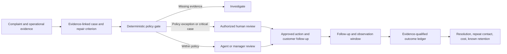

# Evidence-Backed Recovery

[](https://github.com/shuyan-code/evidence-backed-recovery/actions/workflows/ci.yml)
[](LICENSE)
[](https://www.python.org/downloads/)

An open-source Agent Skill and dependency-free Python CLI for **B2B customer support recovery**. Link a complaint to evidence, check a proposed remedy against policy, route decisions to a human, and track whether follow-up worked. It does not send messages or issue refunds.

**Good fit:** support or customer-success teams with written concession rules that need a reviewable way to handle serious service failures.

[Try the example](#try-it) · [Read the market research](docs/market-research.md) · [Contribute](CONTRIBUTING.md)

## Why this exists

Sentiment labels and empathetic reply drafts do not tell a team whether the claimed failure is verified, who may approve a remedy, whether the underlying service was repaired, what the concession costs, or whether the customer problem remained fixed. This project connects those decisions in one reviewable workflow. See [market analysis](docs/market-research.md) for the demand signals, comparable products, buyer risks, and differentiation limits.

## Who uses it

- **Support lead:** triages a high-friction case, verifies evidence, and prepares a response with a named owner and follow-up date.
- **Customer-success manager:** reviews a proposed concession against policy and records actual authorization in the organization's normal system.
- **Operations analyst:** examines evidence-qualified resolution, follow-up timeliness, repeat complaints after a defined window, known retention, and actual concession cost by currency. These are descriptive metrics; the tool does not claim causal ROI.

## Try it

Clone the repository and run the example with Python 3.11 or newer. The CLI has no third-party dependencies and makes no network requests.

```bash
git clone https://github.com/shuyan-code/evidence-backed-recovery.git
cd evidence-backed-recovery
python skills/evidence-backed-recovery/scripts/recovery.py assess --case examples/case.json --policy examples/policy.json --output packet.json
```

The sample produces a `manager_review` packet because the proposed credit exceeds the agent limit. A review status is not authorization. Inspect the packet, then try the sample record and report commands:

```bash
python skills/evidence-backed-recovery/scripts/recovery.py record --case examples/case.json --policy examples/policy.json --packet packet.json --outcome examples/outcome.json --db recovery.sqlite3
python skills/evidence-backed-recovery/scripts/recovery.py report --db recovery.sqlite3
```

The sample approval and evidence references are synthetic; never reuse them for a real case. For agent use, copy `skills/evidence-backed-recovery` into your agent's skill directory or point a compatible agent to its `SKILL.md`. The recorder rechecks the case and policy against the packet, requires verified resolution evidence, and rejects outcomes recorded before the minimum repeat-contact observation window elapses. See [the schema](skills/evidence-backed-recovery/references/schema.md) for all fields and decision statuses.

## What it checks

- **Evidence:** keeps customer statements separate from independent operational records.
- **Policy:** applies deterministic remedy and amount limits, with human review for exceptions and critical failures.
- **Recovery:** requires a repair action, an observable recovery criterion, a named owner, and dated follow-up.
- **Outcomes:** tracks verified resolution, repeat contact after the configured window, known retention, and actual concession cost in a local SQLite ledger.

The workflow is designed as a portable review component alongside an existing ticketing system, not a replacement for one.

## Decision flow



The skill drafts communication, but it never sends messages, issues credits, changes an account, or fabricates an approval. The local ledger stores no complaint text, evidence observations, or customer contact details. Treat case files and the ledger as internal business data; apply your organization's access and retention controls. Version 1 ledger rows are preserved during migration and reported separately as legacy records without verified outcome evidence.

## Commercial loop

The open-source core is free under MIT. A support team can pilot it with existing tickets and policy. The measurable value hypothesis is reduced rework and more consistent recovery decisions: evidence, repair criteria, and approval are checked before a concession, and outcomes and costs are measured after follow-up. A viable service business around this core would offer deployment, policy configuration, verified integrations, and operations reporting. That is a proposed business model, not a claim of validated sales or achieved retention lift. Manual JSON entry is a real barrier to high-volume adoption; the [market analysis](docs/market-research.md) defines a pilot that can disprove the business hypothesis.

## Help improve it

If this workflow is useful, a GitHub star helps other support and customer-success teams discover it. Bug reports and feature requests are welcome through [GitHub Issues](https://github.com/shuyan-code/evidence-backed-recovery/issues). Please share only synthetic or fully de-identified examples; never post customer records, private policies, or approval data.

## Quality and limits

Run `python -m unittest discover -s tests -v` and the skill validator shown in [CONTRIBUTING.md](CONTRIBUTING.md). CI runs behavioral tests, Python compilation, and an independent skill metadata check on Windows and Linux. The packet consistency check does not authenticate input files or approval references or provide a tamper-evident audit trail; production integrations should verify the approver, current policy, case state, and action at execution time. This repository contains no CRM connector or live billing action.

## License

MIT. See [LICENSE](LICENSE).
