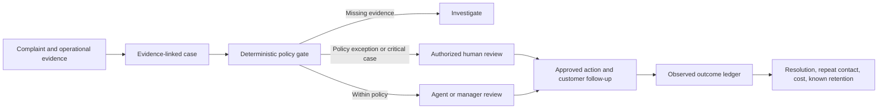

# Evidence-Backed Recovery

An open-source Agent Skill for B2B support and customer-success teams handling emotionally charged service failures. It turns a complaint into an evidence-linked recovery proposal, checks concessions against a local policy, requires human approval for business actions, and records the observed outcome in a minimal SQLite ledger.

## Why this exists

Sentiment labels and empathetic reply drafts do not tell a team whether the claimed failure is verified, who may approve a remedy, what it costs, or whether the customer problem was later resolved. This project connects those decisions in one reviewable workflow. See [market research](docs/market-research.md) for the demand signals, surveyed alternatives, and differentiation limits.

## Who uses it

- **Support lead:** triages a high-friction case, verifies evidence, and prepares a response with a named owner and follow-up date.
- **Customer-success manager:** reviews a proposed concession against policy and records actual authorization in the organization's normal system.
- **Operations analyst:** examines resolution, repeat complaint, known retention, and concession cost by currency. These are descriptive metrics; the tool does not claim causal ROI.

## Install

Copy `skills/evidence-backed-recovery` into your agent's skill directory, or point a compatible agent to its `SKILL.md`. Python 3.11+ is required for the optional CLI. The CLI has no third-party dependencies and makes no network requests.

```bash
python skills/evidence-backed-recovery/scripts/recovery.py assess \
  --case examples/case.json --policy examples/policy.json --output packet.json
```

Review `packet.json` before any external action. A `manager_review` packet is a request for review, not an approval. Record an outcome only after the real customer interaction and required authorization:

```bash
python skills/evidence-backed-recovery/scripts/recovery.py record \
  --packet packet.json --outcome examples/outcome.json --db recovery.sqlite3
python skills/evidence-backed-recovery/scripts/recovery.py report --db recovery.sqlite3
```

The example approval reference is synthetic. Never reuse it for a real case. See [the schema](skills/evidence-backed-recovery/references/schema.md) for fields and decision statuses.

## Decision flow



The skill drafts communication, but it never sends messages, issues credits, changes an account, or fabricates an approval. The local ledger stores no complaint text, evidence observations, or customer contact details. Treat case files and the ledger as internal business data; apply your organization's access and retention controls.

## Commercial loop

The open-source core is free under MIT. A support team can use it immediately with existing tickets and policy. The measurable value hypothesis is reduced rework and more consistent recovery decisions: evidence and approval are checked before a concession, and outcomes and costs are measured after follow-up. A viable service business around this core would offer deployment, policy configuration, integrations, and operations reporting. That is a proposed business model, not a claim of validated sales or achieved retention lift.

## Quality and limits

Run `python -m unittest discover -s tests -v` and the skill validator shown in [CONTRIBUTING.md](CONTRIBUTING.md). CI runs behavioral tests, Python compilation, and an independent skill metadata check on push and pull requests. The policy gate does not authenticate approval references or provide a tamper-evident audit trail; production integrations should verify references against the organization's source system. This repository contains no CRM connector or live billing action.

## License

MIT. See [LICENSE](LICENSE).

