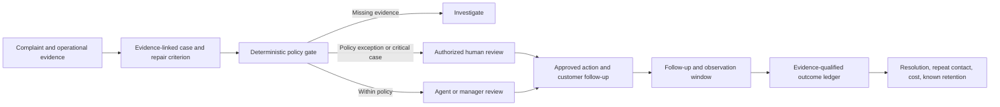

# Evidence-Backed Recovery

An open-source Agent Skill for B2B support and customer-success teams handling emotionally charged service failures. It turns a complaint into an evidence-linked recovery proposal, checks concessions against a local policy, requires human approval for business actions, and records evidence-qualified follow-up outcomes in a minimal SQLite ledger.

## Why this exists

Sentiment labels and empathetic reply drafts do not tell a team whether the claimed failure is verified, who may approve a remedy, whether the underlying service was repaired, what the concession costs, or whether the customer problem remained fixed. This project connects those decisions in one reviewable workflow. See [market analysis](docs/market-research.md) for the demand signals, comparable products, buyer risks, and differentiation limits.

## Who uses it

- **Support lead:** triages a high-friction case, verifies evidence, and prepares a response with a named owner and follow-up date.
- **Customer-success manager:** reviews a proposed concession against policy and records actual authorization in the organization's normal system.
- **Operations analyst:** examines evidence-qualified resolution, follow-up timeliness, repeat complaints after a defined window, known retention, and actual concession cost by currency. These are descriptive metrics; the tool does not claim causal ROI.

## Install

Copy `skills/evidence-backed-recovery` into your agent's skill directory, or point a compatible agent to its `SKILL.md`. Python 3.11+ is required for the optional CLI. The CLI has no third-party dependencies and makes no network requests.

```bash
python skills/evidence-backed-recovery/scripts/recovery.py assess --case examples/case.json --policy examples/policy.json --output packet.json
```

Review `packet.json` before any external action. A `manager_review` packet is a request for review, not an approval. Record an outcome only after the real customer interaction and required authorization:

```bash
python skills/evidence-backed-recovery/scripts/recovery.py record --case examples/case.json --policy examples/policy.json --packet packet.json --outcome examples/outcome.json --db recovery.sqlite3
python skills/evidence-backed-recovery/scripts/recovery.py report --db recovery.sqlite3
```

The example approval and evidence references are synthetic. Never reuse them for a real case. The recorder rechecks the case and policy against the packet, requires verified resolution evidence, and rejects an outcome until the policy's minimum repeat-contact observation window has elapsed. It also rejects a future recording date, so the host clock must be reliable. See [the schema](skills/evidence-backed-recovery/references/schema.md) for fields and decision statuses.

## Decision flow



The skill drafts communication, but it never sends messages, issues credits, changes an account, or fabricates an approval. The local ledger stores no complaint text, evidence observations, or customer contact details. Treat case files and the ledger as internal business data; apply your organization's access and retention controls. Version 1 ledger rows are preserved during migration and reported separately as legacy records without verified outcome evidence.

## Commercial loop

The open-source core is free under MIT. A support team can pilot it with existing tickets and policy. The measurable value hypothesis is reduced rework and more consistent recovery decisions: evidence, repair criteria, and approval are checked before a concession, and outcomes and costs are measured after follow-up. A viable service business around this core would offer deployment, policy configuration, verified integrations, and operations reporting. That is a proposed business model, not a claim of validated sales or achieved retention lift. Manual JSON entry is a real barrier to high-volume adoption; the [market analysis](docs/market-research.md) defines a pilot that can disprove the business hypothesis.

## Quality and limits

Run `python -m unittest discover -s tests -v` and the skill validator shown in [CONTRIBUTING.md](CONTRIBUTING.md). CI runs behavioral tests, Python compilation, and an independent skill metadata check on Windows and Linux. The packet consistency check does not authenticate input files or approval references or provide a tamper-evident audit trail; production integrations should verify the approver, current policy, case state, and action at execution time. This repository contains no CRM connector or live billing action.

## License

MIT. See [LICENSE](LICENSE).
